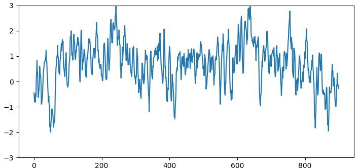
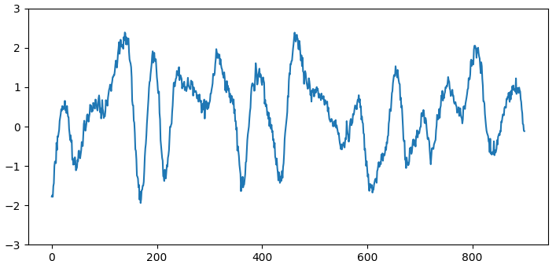

# Conditional Diffusion for EEG Data Synthesis

<p align="center">
  
  
</p>

<p align="center">
  <em>Synthetic EEG data samples generated by the diffusion model (Left: healthy, Right: seizure).</em>
</p>


In this project, we train a diffusion model on EEG data (healthy and seizure) to generate realistic-looking synthetic samples. Our model makes use of the diffusion model pytorch framework from [lucidrains](https://github.com/lucidrains/denoising-diffusion-pytorch/), which is a pytorch implementation of the paper **"Denoising Diffusion Probabilistic Models" by Ho et al. (2020)**. In our implementation, we extend this framework to work with single-channel 1-dimensional data, and add conditioning on the label (healthy and seizure) via cross-attention.

The dataset used in this project is the **TUH EEG Seizure Corpus**, which contains EEG data from healthy and seizure patients. Access to this dataset can be requested [here](https://isip.piconepress.com/projects/tuh_eeg/html/downloads.shtml). We preprocess the data by selecting 4-second seizure and non-seizure windows from channel Cz, sampled at 250 Hz, and apply a bandpass filter to remove noise above 40hz, and drifts below 0.5hz. We then train the diffusion model on this preprocessed data.

## Setup

Clone the repository:

```sh
git clone https://github.com/Andrea4-sr/AML_Diffusion_EEG.git
cd AML_Diffusion_EEG
```

This project was developed using Python 3.8.18. To install the required packages, create a new conda/venv environment and run the following command:

```sh
pip install -r requirements.txt
```

## Sampling from the diffusion model

To sample from the pretrained diffusion model, download the weights of the model [here (227 MB)](https://filesender.switch.ch/filesender2/?s=download&token=159a54a2-7962-4844-94da-ab99eba36c55).

1. Download the weights and add them to a `weights` folder (in root).
2. Run the `src/sample_from_model.py` file to generate and visualize synthetic EEG samples. (Warning: CUDA might be required to run this script.)

## Reproducing validation results

We generate synthetic EEG samples using the diffusion model and train three simple SVMs on Fast Fourier Transform features from the EEG signals: the first trained on 1000 samples of real validation data and the second on 1000 samples of synthetic data, and the final one on 20k samples of synthetic data. We evaluate their AUROCs every 200 samples on both real and synthetic data.

To reproduce the results, run the following command:

```sh
sh validate.sh
```

This will save the results in the `results` folder, including saved metrics and plots of each classifier.

## Folder structure

```plaintext
AML_DIFFUSION_EEG
├───data                            # EEG data with 1:1 class balance (healthy and seizure samples)
│   ├───real
│   │   ├───classifier_train        # Real data training split (1k samples)
│   │   │   ├───fnsz
│   │   │   └───non_seizure
│   │   └───validation              # Real data validation split (1k samples)
│   │       ├───fnsz
│   │       └───non_seizure
│   └───synthetic
│       ├───classifier_train        # Synthetic data training split (20k samples)
│       │   ├───fnsz
│       │   └───non_seizure
│       └───validation              # Synthetic data validation split (1k samples)
│           ├───fnsz
│           └───non_seizure
├───misc
│   ├───media                       # Images
│   ├───presentation                # Presentation slides
│   └───references                  # References    
├───results                         # Validation results  
├───src                             # All data preparation, training, evaluation and sampling scripts 
│   └───models                      # Diffusion model classes
├───statistics                      # Statistics of the dataset
└───weights                         # Pretrained weights of the diffusion model (downloaded)
```

## Citations

Shah, V., von Weltin, E., Lopez, S., McHugh, J. R., Veloso, L., Golmohammadi, M., Obeid, I., & Picone, J. (2018). The Temple University Hospital Seizure Detection Corpus. Frontiers in Neuroinformatics, 12. https://www.frontiersin.org/articles/10.3389/fninf.2018.00083

Ho, J., Jain, A., & Abbeel, P. (2020). Denoising Diffusion Probabilistic Models. In H. Larochelle, M. Ranzato, R. Hadsell, M. F. Balcan, & H. Lin (Eds.), Advances in Neural Information Processing Systems (Vol. 33, pp. 6840-6851). Curran Associates, Inc. https://proceedings.neurips.cc/paper/2020/file/4c5bcfec8584af0d967f1ab10179ca4b-Paper.pdf

Sunkara, R., & Luo, T. (2022). No More Strided Convolutions or Pooling: A New CNN Building Block for Low-Resolution Images and Small Objects. ArXiv, abs/2208.03641.

Karras, T., Aittala, M., Lehtinen, J., Hellsten, J., Aila, T., & Laine, S. (2023). Analyzing and Improving the Training Dynamics of Diffusion Models. ArXiv, abs/2312.02696. https://api.semanticscholar.org/CorpusID:265659032
